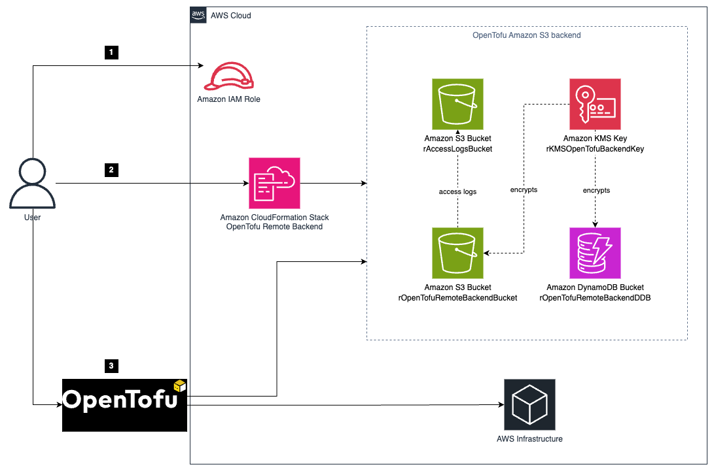

# OpenTofu S3 Backend Setup

This directory contains scripts and templates to set up a secure and robust Amazon S3 remote backend for OpenTofu that will store the OpenTofu state remotely instead of keeping it locally.

The initial setup and configuration is based on: https://github.com/aws-samples/bootstrap-amazon-s3-remote-backend-for-open-tofu/tree/main

**Improvements are:**
* Updated script to make be reusable by asking for a project name and environment
* Added option to specify which AWS CLI profile to use
* Added extra default tags to the AWS resources

## Architecture Overview

The CloudFormation template creates:

* Two Amazon S3 Buckets: 
    * One for OpenTofu state remote storage with encryption and versioning
    * One for access logs with appropriate lifecycle rules
* One Amazon KMS Key for S3 bucket encryption
* One Amazon DynamoDB Table for state locking

All resources are tagged with your project name and include retain policies to prevent accidental deletion.



## Usage

### Deploying the OpenTofu Backend

To deploy the OpenTofu backend infrastructure, execute:

```shell
./init-backend.sh [path/to/opentofu/project]
```

Where:
- `[path/to/opentofu/project]` is an optional argument specifying the OpenTofu project directory. If not provided, the script will use the parent directory by default.

You will be prompted for:
1. Project name (required)
2. Environment name (optional, e.g., dev, prod)
3. AWS region (defaults to eu-west-1)
4. AWS profile (defaults to "default")

The script performs the following actions:

1. Deploys the `cfn-backend-template.yaml` CloudFormation template
2. Creates all required AWS resources with proper security settings
3. Retrieves and saves the S3 bucket, DynamoDB table, and KMS key information
4. Initializes OpenTofu with the new backend configuration (if main.tf exists)

### Output Files

After running the script, a `backend-info.json` file will be created with all configuration details:

```json
{
  "project": "your-project-name",
  "environment": "dev",
  "region": "eu-west-1",
  "profile": "default",
  "backend": {
    "s3_bucket": "opentofu-backend-your-project-name-dev-123456789012",
    "dynamodb_table": "opentofu-lock-your-project-name-dev",
    "kms_key_id": "abcd1234-ef56-gh78-ij90-klmnopqrstuv",
    "kms_key_alias": "alias/opentofu-backend-your-project-name-dev"
  }
}
```

## Manual Backend Configuration

If you need to manually configure an OpenTofu project to use this backend, follow these steps:

### 1. Create or Update Your main.tf

Your main.tf file should include the backend configuration block:

```hcl
terraform {
  required_providers {
    aws = {
      source  = "hashicorp/aws"
      version = "~> 5.0"
    }
  }
  
  backend "s3" {
    # These values will be provided during 'tofu init'
    # or can be included directly here
    bucket         = "YOUR_S3_BUCKET_NAME"
    key            = "path/to/your/state.tfstate"
    region         = "YOUR_REGION"
    dynamodb_table = "YOUR_DYNAMODB_TABLE_NAME"
    encrypt        = true
  }
}

provider "aws" {
  region  = "YOUR_REGION"
  profile = "YOUR_AWS_PROFILE"  # Optional: Include if using non-default AWS profile
}

# Your OpenTofu resources here
```

Notes:
- The `key` parameter is the path within the S3 bucket where the state file will be stored
- Typically use something like `env/project-name.tfstate` or `terraform.tfstate`
- If using a specific AWS profile, add the `profile` parameter to the provider block

### 2. Initialize with the Backend Configuration

If you didn't include the backend values directly in main.tf, you can provide them during initialization:

```shell
tofu init \
  -backend-config="bucket=YOUR_S3_BUCKET_NAME" \
  -backend-config="region=YOUR_REGION" \
  -backend-config="dynamodb_table=YOUR_DYNAMODB_TABLE_NAME" \
  -backend-config="key=path/to/your/state.tfstate" \
  -backend-config="encrypt=true" \
  -backend-config="profile=YOUR_AWS_PROFILE"
```

### 3. Verify Backend Configuration

After initialization, you can verify the backend is configured correctly:

```shell
tofu state pull
```

This should retrieve the state from the S3 bucket.

## Security Features

The backend configuration includes several security measures:

- KMS encryption for all S3 bucket data
- Access logging to a separate bucket
- Public access blocked for all S3 buckets
- HTTPS-only access enforcement
- State locking with DynamoDB to prevent concurrent modifications
- Versioning enabled to maintain state history
- Deletion protection for critical resources

## File Descriptions

* [init-backend.sh](init-backend.sh): Script to deploy and configure the backend
* [destroy-backend.sh](destroy-backend.sh): Script to safely tear down the backend
* [cfn-backend-template.yaml](cfn-backend-template.yaml): CloudFormation template for infrastructure

## Destroying the Backend Stack

When you need to tear down the backend infrastructure, you should proceed with caution since:
1. The resources have deletion protection enabled
2. You need to ensure all OpenTofu state is safely migrated first

To safely destroy the backend stack:

```shell
# 1. First, make sure you have migrated any important state files from the S3 bucket
# You can download them with:
aws s3 cp s3://YOUR_S3_BUCKET_NAME/path/to/your/state.tfstate ./local-backup.tfstate --profile YOUR_AWS_PROFILE

# 2. Empty the S3 bucket (required before deletion):
aws s3 rm s3://YOUR_S3_BUCKET_NAME --recursive --profile YOUR_AWS_PROFILE

# 3. Delete the CloudFormation stack (replace values with your own):
aws cloudformation delete-stack \
  --stack-name opentofu-backend-YOUR_PROJECT_NAME-YOUR_ENV \
  --region YOUR_REGION \
  --profile YOUR_AWS_PROFILE

# 4. Since resources have DeletionPolicy: Retain, you need to manually delete:
- The S3 buckets (both state and access logs)
- The KMS key

# You can find these resource names in your backend-info.json file
```

**Important Notes:**
- Ensure you have backups of your state files before destroying the backend
- Consider the impact on any projects using this backend
- The CloudFormation stack deletion will fail if the S3 buckets are not empty
- Use the same AWS profile you used during setup when destroying resources
